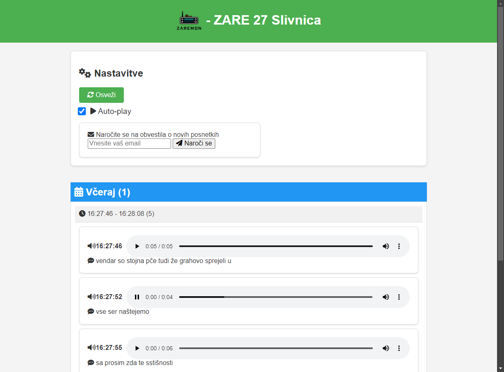

<h1>
    
</h1>



RFMON is a tool that captures and processes FM radio signals. It saves these recordings and organizes them into groups, making it easier to track and follow conversations. This data is then displayed through a web application, providing a user-friendly interface to review the captured audio.

> [!CAUTION]
> **Disclaimer:** Recording conversations or communications without consent may be illegal in your jurisdiction. It is the user's responsibility to ensure that they have obtained all necessary permissions from individuals being recorded. The developer(s) of RFMON are not liable for any misuse of this software.

## Dependencies

- [PHP >= 8](https://www.php.net/releases/8.0/)
- [RTLSDR_Airband](https://github.com/charlie-foxtrot/RTLSDR-Airband)

## Installing

To install RFMON, follow these steps:

0. **(Clone this repository)**

1. **Compile and Install RTLSDR_Airband**:
    - Begin by compiling and installing the RTLSDR_Airband software with narrow FM support. Ensure that you enable the narrow FM option during the compilation process (`cmake -DNFM=ON ../`).

2. **Deploy HTML Folder**:
    - Add a symbolic link for the HTML folder to your deployment directory or configure site settings to point to the html folder. This allows the web application to access the necessary HTML files. Example:
        ```sh
        sudo ln -s /path/to/RFmon/html /var/www/html/rfmon
        ```

3. **Configure Frequency in rfmon_sdr.conf**:
    - Open the `rfmon_sdr.conf` file and configure the frequency settings according to your requirements.

4. **Set Output Paths**:
    - Set the output path to the same wanted directory in both `conf.php` and `rfmon_sdr.conf` files. This ensures that the recordings are stored and then read from in the correct locations.


5. **Create Symlink for rfmon-sdr.service**:
    - Add a symbolic link for the `rfmon-sdr.service` to the `/etc/systemd/system` directory. This ensures that the service can be managed by systemd. Use the following command:
        ```sh
        # Make sure to fix the path to rfmon_sdr.conf in rfmon-sdr.service
        sudo ln -s /path/to/RFmon/rfmon-sdr.service /etc/systemd/system/rfmon-sdr.service
        sudo systemctl daemon-reload
        sudo systemctl enable rfmon-sdr.service
        sudo systemctl start rfmon-sdr.service
        ```

6. **Modify HTML Configuration**:
    - If needed, modify the `html/conf.php` file to adjust any additional settings for the web application.

7. **(Optional) Configure password authentication**:
    - If needed, password authentication can be enabled to prevent people who do not know the password from accessing
      the app. To do this, uncomment the `$PASSWORD` setting in `html/conf.php` or create `html/password.php` file which
      sets the before mentioned variable to your wanted password.

8. **(Optional) Configure watch service**:
    - To enable notifications and/or transcriptions watch service needs to be installed and running. First install following dependencies:
        ```sh
        sudo apt install inotify-tools
        ```

    -  To enable and run the service create a symbolic link for the `rfmon-watch.service` to the `/etc/systemd/system` directory. This ensures that the watch service can be managed by systemd. Use the following commands:
        ```sh
        # Make sure to fix the /path/to/RFmon/watch.sh script inside the service config
        sudo ln -s /path/to/RFmon/rfmon-watch.service /etc/systemd/system/rfmon-watch.service
        sudo systemctl daemon-reload
        sudo systemctl enable rfmon-watch.service
        sudo systemctl start rfmon-watch.service
        ```

8. **(Optional) Configure notifications**:
    - To enable notifications, you need to configure the notification settings in the `html/conf.php`. Adjust the configuration according to your notification preferences.

    - After configuring the notification settings, make sure `notify-watch` service is running (step 8.)

    - Note: **Configure Mail Settings**
        - Ensure that your system is configured to send mail. This is necessary for the notification feature to work correctly. You can use tools like `sendmail`, `postfix`, or any other mail transfer agent (MTA) of your choice. Configure the MTA according to your system's requirements and ensure it is running properly.

9. **(Optional) Configure transcriptions**
    - First install dependencies
        ```sh
        sudo apt install jq curl
        ```

    - To enable transcriptions, you need to enable them `html/conf.php`.

    - After enabling transcriptions, make sure `notify-watch` service is running (step 8.)

    - (*Optional*): Transcribe existing audio recordings by running the script `./transcribe.sh`. 


By following these steps, you will have RFMON installed and configured properly.