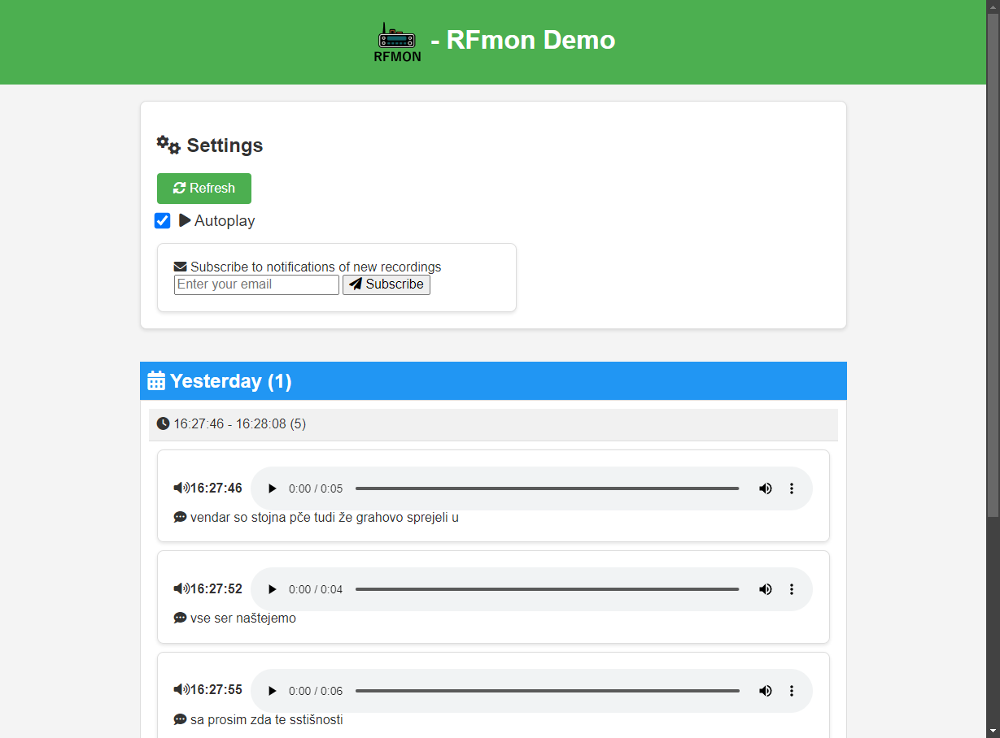

# ZAREMON


ZAREMON is a tool that captures and processes FM radio signals. It saves these recordings and organizes them into groups, making it easier to track and follow conversations. This data is then displayed through a web application, providing a user-friendly interface to review the captured audio.



## Dependencies

- [PHP >= 8](https://www.php.net/releases/8.0/)
- [RTLSDR_Airband](https://github.com/charlie-foxtrot/RTLSDR-Airband)

## Installing

To install ZAREMON, follow these steps:

0. **(Clone this repository)**

1. **Compile and Install RTLSDR_Airband**:
    - Begin by compiling and installing the RTLSDR_Airband software with narrow FM support. Ensure that you enable the narrow FM option during the compilation process (`cmake -DNFM=ON ../`).

2. **Deploy HTML Folder**:
    - Add a symbolic link for the HTML folder to your deployment directory or configure site settings to point to the html folder. This allows the web application to access the necessary HTML files. Example:
        ```sh
        sudo ln -s /path/to/Zaremon/html /var/www/html/zaremon
        ```

3. **Configure Frequency in zare_sdr.conf**:
    - Open the `zare_sdr.conf` file and configure the frequency settings according to your requirements.

4. **Set Output Paths**:
    - Set the output path to the same wanted directory in both `conf.php` and `zare_sdr.conf` files. This ensures that the recordings are stored and then read from in the correct locations.


5. **Create Symlink for zaremon-sdr.service**:
    - Add a symbolic link for the `zaremon-sdr.service` to the `/etc/systemd/system` directory. This ensures that the service can be managed by systemd. Use the following command:
        ```sh
        # Make sure to fix the path to zare_sdr.conf in zaremond-sdr.service
        sudo ln -s /path/to/Zaremon/zaremon-sdr.service /etc/systemd/system/zaremon-sdr.service
        sudo systemctl daemon-reload
        sudo systemctl enable zaremon-sdr.service
        sudo systemctl start zaremon-sdr.service
        ```

6. **Modify HTML Configuration**:
    - If needed, modify the `html/conf.php` file to adjust any additional settings for the web application.

7. **(Optional) Configure password authentication**:
    - If needed, password authentication can be enabled to prevent people who do not know the password from accessing
      the app. To do this, uncomment the `$PASSWORD` setting in `html/conf.php` or create `html/password.php` file which
      sets the before mentioned variable to your wanted password.

By following these steps, you will have ZAREMON installed and configured properly.